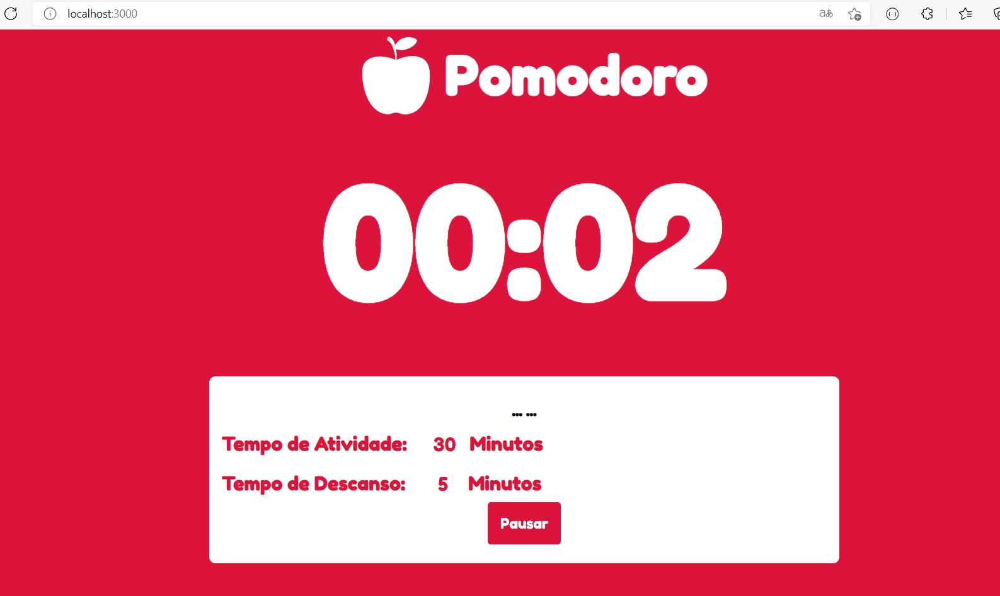
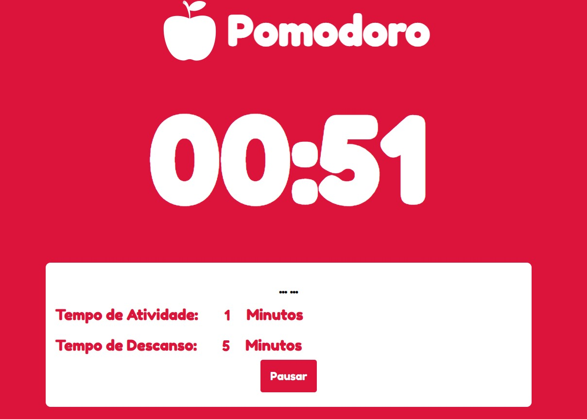
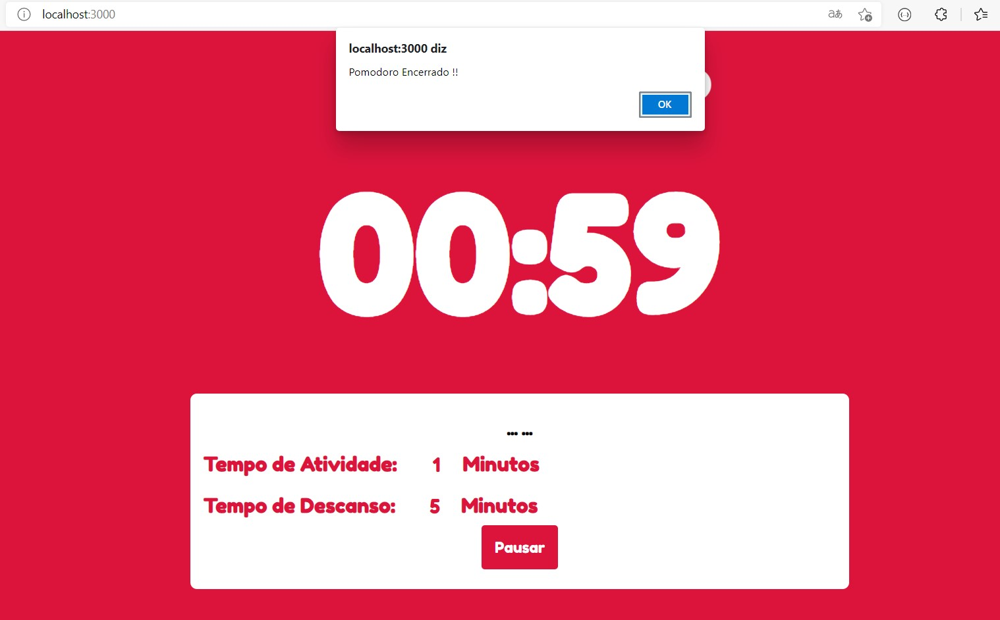

# Pomodoro Contador

| |  | |
|--|--|--|
||  | 
### `npm start`

Executa o aplicativo no modo de desenvolvimento. \
Abra [http://localhost: 3000](http://localhost:3000) para visualizá-lo no navegador.

A página será recarregada se você fizer edições. \
Você também verá quaisquer erros de lint no console.

### `npm run build`
Compila o aplicativo para produção na pasta `build`. \
Ele agrupa corretamente o React no modo de produção e otimiza a construção para o melhor desempenho.

A compilação é reduzida e os nomes dos arquivos incluem os hashes. \
Seu aplicativo está pronto para ser implantado!

Consulte a seção sobre [implantação](https://facebook.github.io/create-react-app/docs/deployment) para obter mais informações.
